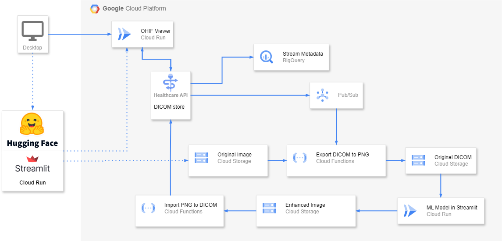

# Kalbe Digital Lab - Doing Data Acquisition for Computer Vision and Medical Imaging Models

# Description 
Nowadays, one of the problems in the medical industry is inadequate datasets. It make takes a long time for radiologist to diagnose diseases from medical imaging images and can also lead to misdiagnosis. Another problem is non centralized data where each hospital still stores datasets on each local PACS and the insecurity of patient data privacy. The problem we want to tackle is to produce a high-quality medical imaging data to prevent misdiagnosis of patients using AI Integration by enhancing DICOM image data. In addition, we want to make the data more secure and centralized by using Cloud-based PACS and Online DICOM Viewer. We used Densenet121 and OHIF as online dicom viewer.

# Dataset
This project uses the following dataset:
- NIH Chest X-ray Dataset: https://cloud.google.com/healthcare-api/docs/resources/public-datasets/nih-chest

# Implementations
## 5 Types of Image Enhancement
There are 4 types of image enhancement models can be selected to improve image quality, namely high pass filter, unsharp masking, histogram equalization and CLAHE. each model is equipped with image quality measurement results including MSE, PSNR, Maxerr and L2Rat. 

## 2 Types of AI Models
There are 2 types of AI models can be selected to automated diagnosis of the image, namely Object Classification using Gradcam and Object Detection using Bounding Box. This model can help radiologists to diagnose the patient's disease easily and quickly.

## Cloud-based PACS
Centralized medical imaging data and analyzing the acquired data in real time through interactive UI assisted by ML models. This allows various healthcare institutions to collaborate and store data in real time, hence solving the inadequacy of the data.

# Demo
The demo of this project is available to be seen at https://huggingface.co/spaces/KalbeDigitalLab/Cloud-PACS-AI-Integration

# Acknowledgements
- (ML) M010D4KY2744 - Rifqi Aditya - Universitas Indonesia
- (ML) M010D4KY2867 - Muhammad Fadli - Universitas Indonesia
- (ML) M010D4KY2895 - Aditya Bintang Aprilio - Universitas Indonesia
- (ML) M010D4KY2508 - Awaludin Ahmad Hafiz - Universitas Indonesia
- (CC) C004D4KY1049 - Timothy Hosia Budianto - Institut Teknologi Sepuluh Nopember
- (CC) C009D4KY0382 - Muhammad Rafi Widyadhana - Universitas Gunadarma

